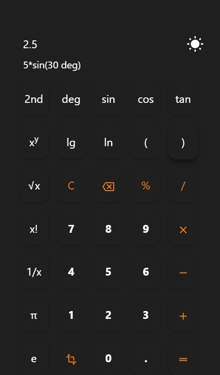
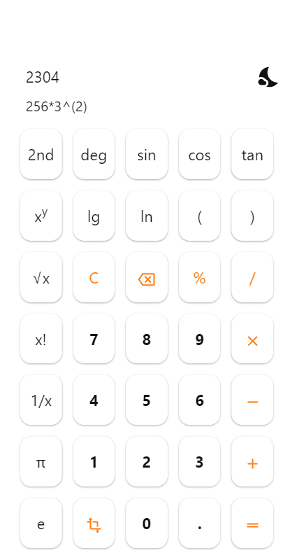

# Responsive Scientific Calculator

This library is responsive scientific calculator with ability of changing theme.

This library use typescript and webpack for bundling code.

You can start adding this responsive calculator to your project in below steps.

First add library with npm to your project.

```jsx
npm install scientific_calculator_light_dark
```

### Preview of scientific calculator library

    